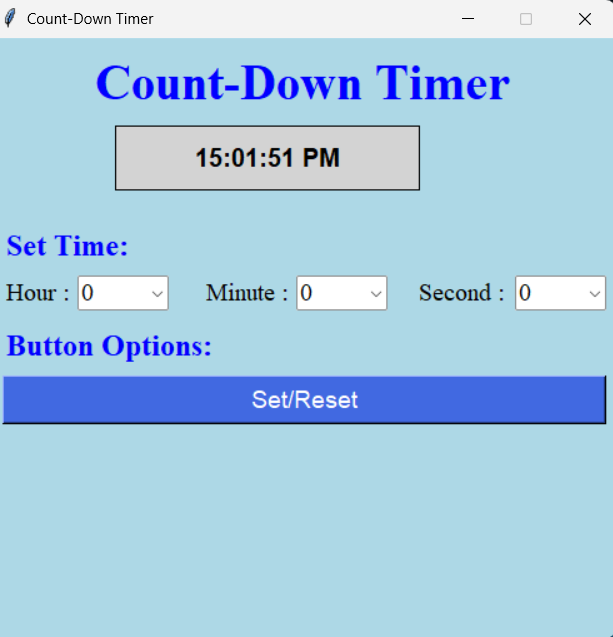
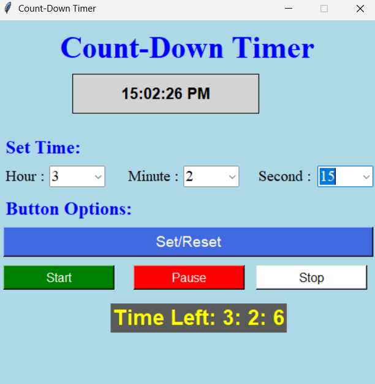
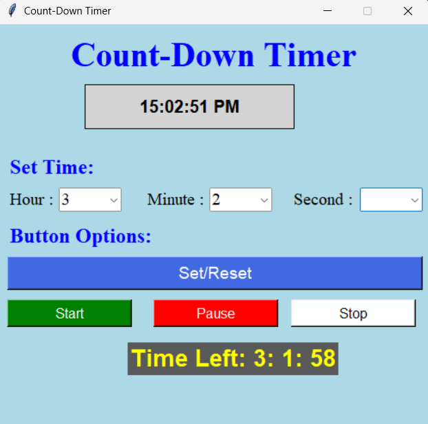

# ⏳ Count-Down Timer

A desktop-based countdown timer application developed using **Python** and **Tkinter**. The application allows users to set a custom countdown using hours, minutes, and seconds while displaying the current system time. It provides an easy-to-use graphical interface with controls to start, pause, reset, and stop the timer.

---

## 📖 Project Overview

The **Count-Down Timer** is a desktop application built to demonstrate Python GUI development using Tkinter. The application allows users to configure a countdown timer and monitor the remaining time in real-time. It also displays the current system time and notifies the user when the countdown reaches zero.

This project was developed to strengthen concepts such as:

- Object-Oriented Programming (OOP)
- GUI Development
- Event-Driven Programming
- Multithreading
- Exception Handling
- User Input Validation

---

## ✨ Features

- 🕒 Live Digital Clock
- ⏳ Custom Countdown Timer
- 🎛️ Hour, Minute, and Second Selection
- ▶️ Start Countdown
- ⏸️ Pause Countdown
- 🔄 Set/Reset Timer
- ⏹️ Stop Timer
- ⚠️ Input Validation
- 💬 Countdown Completion Notification
- 🧵 Multithreading for Smooth GUI Performance

---

## 📸 Screenshots

### Home Screen

Displays the current system time and allows users to configure the countdown timer.



---

### Timer Configured

Shows the configured timer with available controls.



---

### Countdown Running

Displays the remaining countdown time while the timer is active.



---

## 🛠️ Technologies Used

- Python 3
- Tkinter
- ttk Widgets
- Threading
- Time Module
- Tkinter MessageBox

---

## 📂 Project Structure

```text
Countdown_timer/
│
├── images/
│   ├── home-screen.png
│   ├── timer-configured.png
│   └── countdown-running.png
│
├── mini.py
├── README.md
├── LICENSE
└── .gitignore
```

---

## 🚀 Getting Started

### Prerequisites

- Python 3.x

Verify your installation:

```bash
python --version
```

---

### Clone the Repository

```bash
git clone https://github.com/Nehasingh91/Countdown_timer.git
```

Move to the project directory:

```bash
cd Countdown_timer
```

Run the application:

```bash
python mini.py
```

---

## 🖥️ How to Use

1. Launch the application.
2. Select the desired Hour, Minute, and Second.
3. Click **Set/Reset**.
4. Press **Start** to begin the countdown.
5. Use **Pause** to temporarily stop the timer.
6. Press **Start** again to resume.
7. Click **Stop** to close the application.
8. A notification appears when the countdown reaches zero.

---

## ⚙️ Application Workflow

```text
Launch Application
        │
        ▼
Display Current Time
        │
        ▼
Select Hours, Minutes & Seconds
        │
        ▼
Click Set/Reset
        │
        ▼
Press Start
        │
        ▼
Countdown Begins
        │
 ┌──────┴─────────┐
 │                │
 ▼                ▼
Pause          Continue
 │                │
 └──────┬─────────┘
        │
        ▼
Countdown Ends
        │
        ▼
Display Notification
```

---

## 🧠 Concepts Demonstrated

- Object-Oriented Programming (OOP)
- Python GUI Development
- Event Handling
- Multithreading
- Input Validation
- Exception Handling
- Time Management
- Dynamic Widget Updates

---

## 📋 Project Highlights

- Simple and user-friendly interface
- Real-time digital clock
- Configurable countdown timer
- Start, Pause, Reset, and Stop controls
- Responsive GUI using multithreading
- Completion notification
- Clean Python implementation

---

## 🔮 Future Enhancements

- 🔔 Alarm sound when the countdown finishes
- 🎵 Custom notification sound
- 🌙 Dark mode
- 🎨 Theme customization
- 📊 Circular progress indicator
- 💾 Save timer presets
- ⏱️ Multiple countdown timers
- 📌 Minimize to system tray
- 🔁 Resume timer after restarting the application

---

## 📚 Learning Outcomes

This project helped me improve my understanding of:

- Python Programming
- Tkinter GUI Development
- Thread Management
- Event-Driven Programming
- Object-Oriented Design
- User Interface Design
- Exception Handling

---

## 🤝 Contributing

Contributions are welcome!

1. Fork the repository.
2. Create a feature branch.

```bash
git checkout -b feature-name
```

3. Commit your changes.

```bash
git commit -m "Add new feature"
```

4. Push your branch.

```bash
git push origin feature-name
```

5. Open a Pull Request.

---

## 🐞 Known Limitations

- Supports only one countdown timer.
- No alarm sound when the timer finishes.
- Timer settings are not saved.
- Desktop application only.

---

## 📄 License

This project is licensed under the **MIT License**.

---

## 👩‍💻 Author

**Neha Singh**

Software Developer exploring Data Analysis while building practical Python, SQL, Data Warehouse, and Full-Stack Development projects.

GitHub: https://github.com/Nehasingh91

---

## ⭐ Support

If you found this project helpful, consider giving it a ⭐ on GitHub. Your support is appreciated!
